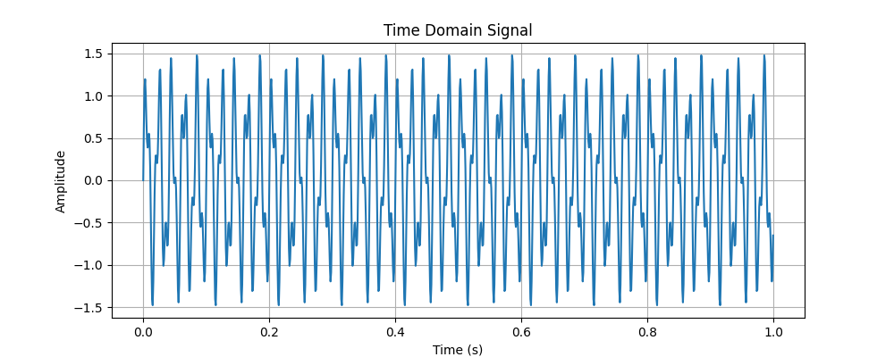
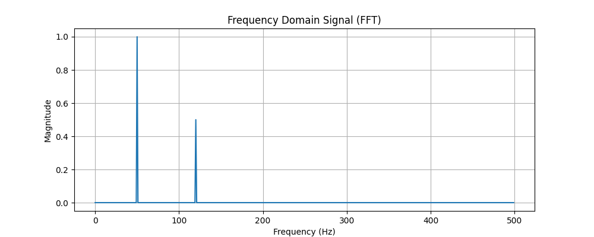

# DSP Simulation

## Project Overview
This project simulates digital signal processing (DSP) techniques using Python. It demonstrates the generation of composite signals, Fast Fourier Transform (FFT) analysis, and visualization of both time-domain and frequency-domain representations. The project highlights skills in Python programming, signal processing, and data visualization.

---

## Key Features
- **Sine Wave Generation:** Creates a composite signal with multiple frequencies.
- **Fast Fourier Transform (FFT):** Performs frequency domain analysis to extract signal components.
- **Signal Visualization:** Displays time-domain and frequency-domain representations of signals.
- **Extensible Design:** Prepared for enhancements like FIR/IIR filtering and machine learning-based analysis.

---

## Technologies Used
- **Languages:** Python
- **Libraries:** NumPy, SciPy, Matplotlib
- **Tools:** Visual Studio Code, Jupyter Notebook (optional)

---

## Setup Instructions
1. **Clone the Repository:**
```bash
git clone https://github.com/bryanmalak/DSP-Simulation.git
cd DSP-Simulation
```

2. **Install Dependencies:**
```bash
pip install numpy scipy matplotlib
```

3. **Run the Simulation:**
```bash
python3 dsp_simulation.py
```

---

## Screenshots
### Time Domain Signal


### Frequency Domain Signal (FFT)


---

## Future Enhancements
- Implement FIR/IIR filters for real-time signal filtering.
- Add support for processing live data streams.
- Incorporate machine learning algorithms for predictive analysis.

---

## How to Contribute
1. Fork the repository.
2. Create a new branch:
```bash
git checkout -b feature-branch
```
3. Commit changes and push:
```bash
git commit -m "Feature: Add FIR filter"
git push origin feature-branch
```
4. Create a Pull Request.

---

## Contact Information
- **Author:** Bryan Malak
- **GitHub:** [bryanmalak](https://github.com/bryanmalak)
- **Email:** bvmalak@gmail.com

---

This project serves as a foundational tool for demonstrating DSP concepts and skills, making it a strong addition to your portfolio.

